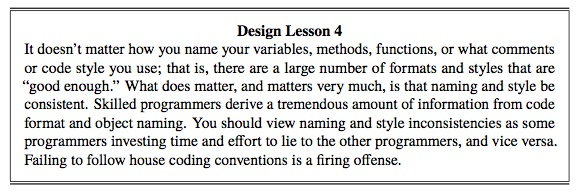

<html>
<head>
  
</head>

<body>
  
  

  <section class="content box">
    <h2 id="top">LaTeX to Lulu: The Making of AOSA</h2>
    <h3 class="l2l">4. Custom Commands and Environments</h3>
    
Originally posted: June 1, 2012

    

      This article is about the custom LaTeX commands and environments we
      created for the AOSA books.
    

    

      As I said in <a title="LaTeX to Lulu, The Making of AOSA: Table of
        Contents and Chapter Titles"
        href="0530-latex-toc-chapter-titles.html">Table of Contents and Chapter
        Titles</a>, we had to set up some new commands and environments to deal
      with the fact that each chapter of the AOSA book has a different author
      or team of authors. LaTeX has a built-in command (or variable) called
      <code>author</code>, so we call ours <code>chapterauthor</code>.
      

      
\newcommand{\chapterauthor}{}

      

        We created an environment called <code>aosachapter</code> to take the
        name of the chapter, the label (a unique string which identifies the
        chapter) and the author name(s). It sets all the respective LaTeX
        settings with the appropriate values, and then populates the table of
        contents.
      

      

        \newenvironment{aosachapter}[3] 
        { \renewcommand{\chapterauthor}{#3} \chapter{#1} \label{#2} 
        \addtocontents{toc}{\hspace{1cm}\textit{\textsf{by \chapterauthor}}\protect\par} } {  }
      

      

        We created some environments which were basically just better names for
        existing LaTeX environments. That was Greg's doing, and at first it
        seemed pretty pointless to me. But later, when I wanted to change the
        design of an environment, it was handy to have our own custom
        environment defined so I could change it.
      

      

        Having said that, clearly I didn't futz with the following three
        environments, but they were there if I needed to:
      

      

        \newenvironment{aosasect1}[1]{\section{#1}}{} 
        \newenvironment{aosasect2}[1]{\subsection{#1}}{} 
        \newenvironment{aosasect3}[1]{\subsubsection*{#1}}{} 
      

      <h4>Sidebar</h4>
      

        There is no sidebar environment in LaTeX, so I created a sidebar called
        <code>aosabox</code> using <code>figure</code>, <code>minipage</code>
        and the <code>framed</code> package. <code>figure</code> tells LaTeX
        that the sidebar is an entity that isn't part of the text and that
        doesn't break over a page. <code>framed</code> lets you put a box
        around the <code>minipage</code>. I also added a rule at the top and
        the bottom of the box to create a double line for texture.
      

      

        \newenvironment{aosabox}[1] 
        { \begin{figure}[h!]\vspace{-0.7cm}\centering \rule[-.7cm]{13.83cm}{0.75pt}  
        \begin{minipage}[t]{13.83cm}\begin{framed}\centerline{{\textbf{#1}}} } 
        { \end{framed}\end{minipage} \rule{13.83cm}{0.75pt} \end{figure} } 
      

      

        Here's how the sidebar looks (this is one of the lessons from the <a title="BDB chapter" href="http://www.aosabook.org/en/bdb.html">BDB chapter</a> in Volume I):
      

      
</a>

      

      <h4>List Environments</h4>
      

        We created custom environments to replace LaTeX's three list types:
        <code>aosadescription</code>, <code>aosaenumerate</code>, and
        <code>aosaitemize</code>. This is where I did a lot of futzing: I didn't
        like the spacing in the default lists, so I spent a lot of time
        fiddling with these settings.
      

      

        \newenvironment{aosadescription} 
        {\begin{description}[itemsep=-0.1ex,parsep=0.3ex,topsep=0.2ex,leftmargin=10mm]} 
        {\end{description}} 
         
        \newenvironment{aosaenumerate} 
        {\begin{enumerate}[itemsep=-0.8ex,topsep=0.2ex,leftmargin=10mm]} 
        {\end{enumerate}} 
         
        \newenvironment{aosaitemize} 
        {\begin{itemize}[itemsep=-0.8ex,topsep=0.2ex,leftmargin=8.5mm]} 
        {\end{itemize}} 
      

      

        Some chapters had lists nested within lists, and the spacing I'd set up
        for the outer lists didn't work for the nested lists, so I created new
        environments for them.
      

      

        % new environment for second-level nested enumerated lists 
        \newenvironment{aosaenumerate2} 
        {\begin{enumerate}[itemsep=-0.7ex,topsep=-1ex,leftmargin=10mm]} 
        {\end{enumerate}} 
         
        % new environment for second-level nested itemized lists 
        \newenvironment{aosaitemize2} 
        {\begin{itemize}[itemsep=-0.5ex,topsep=-1ex,leftmargin=9mm]} 
        {\end{itemize}} 
      

      <h4>References</h4>
      

        We set up new commands for references. LaTeX's default references just
        give you the number of the object you're referencing (like "12.1" for
        the first section in the 12th chapter). Our commands are specific to
        the object you're referencing &mdash; <code>aosafigref</code> for
        figures and
        <code>aosasecref</code> for sections &mdash; and they return "Figure "
        or "Section " as well as the number.
      

      

        \newcommand{\aosaboxref}[1]{Box~\ref{#1}} 
        \newcommand{\aosachapref}[1]{Chapter~\ref{#1}} 
        \newcommand{\aosafigref}[1]{Figure~\ref{#1}} 
        \newcommand{\aosasecref}[1]{Section~\ref{#1}} 
        \newcommand{\aosatblref}[1]{Table~\ref{#1}} 
      

      <h4>Images</h4>
      

        We created a new command for images. Again, it uses LaTeX's default
        <code>figure</code> and <code>includegraphics</code> settings but
        accepts and passes on our parameters so we can enforce consistent image
        layout throughout the book.
      

      

        The command, <code>aosafigure</code>, accepts the image width, the
        filename of the image, the caption, and a unique label for the figure.
        It passes the width and filename to <code>includegraphics</code>, the
        caption to <code>caption</code> and the label to <code>label</code>.
        Width is an optional parameter, and if it's not passed in we set the
        default to be 375 points. (LaTeX automatically scales the image and
        keeps the aspect ratio, so you only have to pass in width.)
      

      

        \newcommand{\aosafigure}[4][375pt]{\begin{figure}[h!]\centering\includegraphics 
        [width={#1}]{#2}\caption{#3}\label{#4}\end{figure}} 
      

      

      In the <code>aosafigure</code> command we called <code>figure</code> with the <code>h!</code> option, which stands for "here" and means we want the figure to be placed as close to where it is defined in the source as possible. (The exclamation mark means we <em>really mean it</em>.) But sometimes I wanted the figure to be placed at the top of the nearest page, say if it is a large image and would look awkward with just a few lines of text above it. So I created an <code>aosafigureTop</code> command for those cases.
      

      

        \newcommand{\aosafigureTop}[4][375pt]{\begin{figure}[t]\centering\includegraphics 
        [width={#1}]{#2}\caption{#3}\label{#4}\end{figure}} 
      

      <h4>Code</h4>
      

      We created a new command called <code>code</code> for code examples, 
      instead of LaTeX's <code>texttt</code>.
      

      
\newcommand{\code}[1]{\texttt{#1}}

      

        I also created a "small code" command for one table in one chapter
        which needed a smaller text size.
      

      
\newcommand{\smcode}[1]{\small\texttt{#1}\normalsize}

      

        That's all our custom commands and environments. Next time: a
        compendium of the miscellaneous packages and settings which didn't fit
        into the first four articles of this series.
      

    

    Previous: <a href="0530-latex-toc-chapter-titles.html">Table of Contents and Chapter Headings</a> |
    <a href="/articles.html">Articles</a> | 
    Next: <a href="0604-latex-useful-packages-and-settings.html">Useful Packages and Settings</a>.
   

  </section>

  

</body>
</html>
